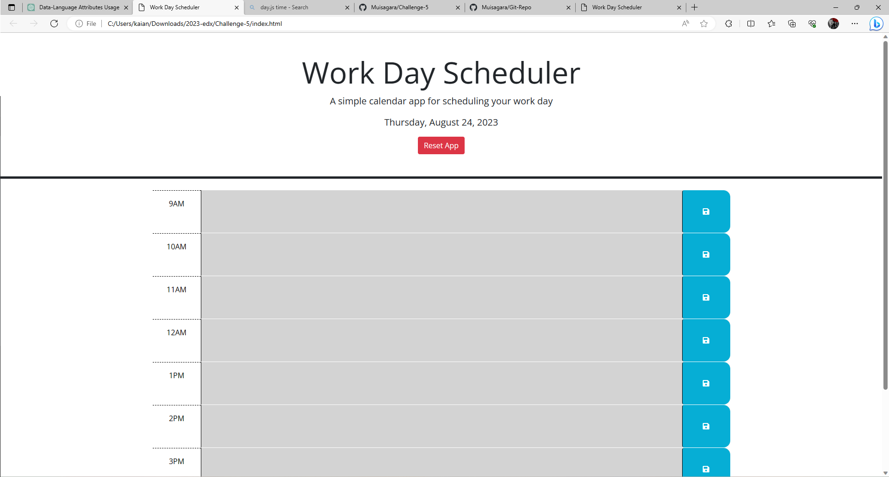

# Challenge-5

## User Story
AS AN employee with a busy schedule
I WANT to add important events to a daily planner
SO THAT I can manage my time effectively

## Description
A calender app that keeps track of events in an 9-5 schedule.

## Usage
<ul> 
    <li> Helps time management </li>
    <li> Allows to clear and reset app for mulitple uses.</li>
    <li> Updates time to show if a event has passed. </li>
    <li> Reset button to clear schedule for multiple uses.</li>
</ul>

## Deployed Site
[GitHub](https://github.com/Muisagara/Challenge-5)

[Calender-App](https://muisagara.github.io/Challenge-5/)

## Screenshots

## Credited Sources
The Xpert assisted me with code 
